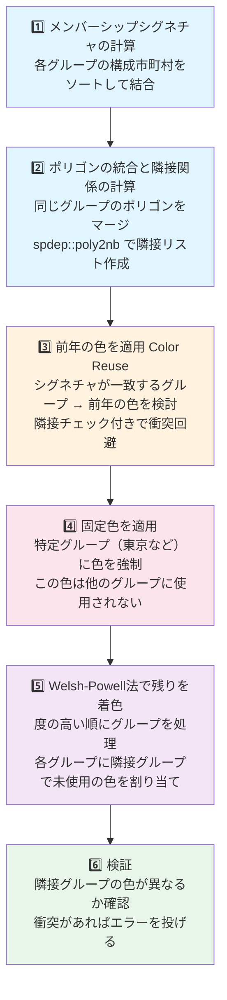
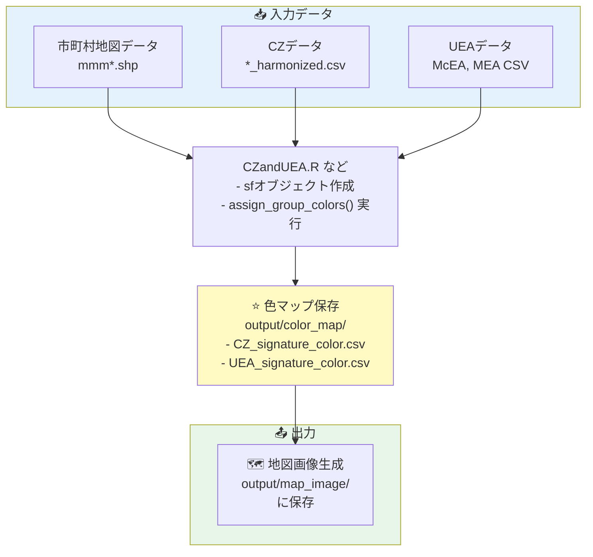

# 色分け（Color Assignment）の詳細

このドキュメントは、通勤圏（CZ）と都市雇用圏（UEA）の地図作成における色分けのアルゴリズムと、各コードが生成する地図について詳しく説明します。

## 概要

色分けは、隣接するポリゴンに異なる色を割り当てる**グラフ着色問題**です。目的は：

1.  隣接する通勤圏/都市雇用圏に異なる色を割り当てる
2.  年を跨いで同じ構成の地域は同じ色を使用する（色の再利用）
3.  特定地域（例：東京）の色を固定する
4.  視認性を高めるため、最小限の色数で着色する

## グラフ着色アルゴリズムの詳細

### 問題の定義

**入力：** - ポリゴン集合（各ポリゴンはJISCODEでラベル付け） - グループ情報（各ポリゴンをグループに割り当て） - 色パレット

**出力：** - グループごとの色割り当て

**制約：** - 隣接するポリゴンは異なる色を持つ必要がある - 必要な色数を最小化する（4色定理により、平面グラフは最大4色で着色可能）

### アルゴリズムの流れ



## コア関数：`assign_group_colors()`

### 関数シグネチャ

``` r
assign_group_colors(
  sf_obj,              # sf オブジェクト（ポリゴン）
  group_col,           # グループ列名（"cluster"または"UEA"）
  colors = RColorBrewer::brewer.pal(5, "Set2"),  # 色パレット
  fixed = NULL,        # 固定する色 list(value = <グループID>, color = <16進色コード>)
  prev_colors = NULL   # 前年の色情報（シグネチャ→色マッピング）
)
```

### 処理の詳細

#### 1. メンバーシップシグネチャの計算

**目的：** 年を跨いで同じ構成のグループを識別

``` r
# 各グループに属するJISCODEを取得・ソート・結合
signatures <- vapply(group_vals, function(g) {
  mem <- grp$JISCODE[grp[[group_col]] == g]
  mem <- sort(unique(as.character(mem)))
  paste(mem, collapse = ",")
}, character(1))
```

**例：**

```         
グループ50：市町村 [13102, 13101, 13103] で構成
↓ 処理
signature = "13101,13102,13103"

10年後にグループ75が同じ市町村で構成された場合
→ signature = "13101,13102,13103" で一致
→ 前年と同じ色を使用可能
```

#### 2. ポリゴンの統合と隣接関係の計算

``` r
# グループごとにポリゴンを統合
grp <- dplyr::group_by_at(grp, group_col)
grp <- dplyr::summarise(grp)  # geomを統合
grp <- sf::st_make_valid(grp) # 無効なジオメトリを修正

# 隣接関係を計算
neighbors <- spdep::poly2nb(grp)
# neighbors[[i]] = グループi に隣接するグループのインデックスリスト
```

**重要：** 統合後のポリゴンで隣接関係を計算することで、複数の市町村で構成されるグループの隣接判定が正確になります。

#### 3. 前年の色を適用（隣接チェック付き）

**新機能：** 隣接グループとの衝突をチェックしてから前年の色を適用

``` r
if (!is.null(prev_colors) && !is.null(grp_signature)) {
  # シグネチャが前年に存在するグループを検出
  matched <- which(grp_signature %in% names(prev_map))
  
  for (idx in matched) {
    proposed_color <- prev_map[grp_signature[idx]]
    neighbor_colors <- color_assignment[neighbors[[idx]]]
    neighbor_colors <- neighbor_colors[!is.na(neighbor_colors)]
    
    # 隣接グループと衝突しない場合のみ色を適用
    if (!proposed_color %in% neighbor_colors) {
      color_assignment[idx] <- proposed_color
    }
    # 衝突する場合はスキップ → Welsh-Powell法で後に処理
  }
}
```

**効果：** - 同じシグネチャのグループが隣接していても異なる色が割り当てられる - 衝突エラーが大幅に減少

#### 4. 固定色の適用

``` r
if (!is.null(fixed) && !is.null(fixed$value) && !is.null(fixed$color)) {
  idx <- which(grp[[group_col]] == fixed$value)
  if (length(idx) > 0) {
    color_assignment[idx] <- fixed$color
  }
}
```

**用途：** 東京都市圏（13100）など重要な地域の色を固定

#### 5. Welsh-Powell法による色割り当て

**アルゴリズム：**

```         
1. 各グループの度（隣接グループ数）を計算
2. 度の大きい順にソート
3. ソート順にグループを処理：
   a. 隣接グループで使用されている色を取得
   b. パレット内で未使用の色を探す
   c. 見つからない場合、パレットを拡張
```

**コード：**

``` r
deg <- vapply(neighbors, length, integer(1))
order_idx <- order(deg, decreasing = TRUE)  # 度が大きい順

for (v in order_idx) {
  if (!is.na(color_assignment[v])) next  # 既に割り当て済みならスキップ
  
  nbcols <- color_assignment[neighbors[[v]]]
  nbcols <- nbcols[!is.na(nbcols)]  # NA を除去
  
  # 固定色も除外
  available <- setdiff(palette, c(nbcols, fixed_color))
  
  # パレット拡張
  while (length(available) == 0) {
    new_n <- max(4, length(palette) * 2)
    palette <- c(palette, 
                 grDevices::colorRampPalette(palette)(new_n)[(length(palette) + 1):new_n])
    available <- setdiff(palette, c(nbcols, fixed_color))
  }
  
  color_assignment[v] <- available[1]  # 最初の利用可能な色を使用
}
```

**最適性：** - 度の高い順に処理することで、パレットサイズを最小化 - 平面グラフの場合、理論値（4色以下）に近い結果を得やすい

#### 6. 検証

``` r
conflicts <- character(0)
for (i in seq_along(neighbors)) {
  for (j in neighbors[[i]]) {
    if (i < j &&
        !is.na(color_assignment[i]) && 
        !is.na(color_assignment[j]) &&
        color_assignment[i] == color_assignment[j]) {
      conflicts <- c(conflicts, 
                     paste0(grp[[group_col]][i], "-", 
                            grp[[group_col]][j], ":", 
                            color_assignment[i]))
    }
  }
}
if (length(conflicts) > 0) {
  stop("Coloring conflict detected between adjacent groups: ", 
       paste(conflicts, collapse = "; "))
}
```

## 実装の詳細

### 固定色の予約（Fixed Color Reservation）

`fixed`パラメータで指定した色は、他のグループには割り当てられません：

``` r
fixed_color <- NULL
if (!is.null(fixed) && !is.null(fixed$color)) {
  fixed_color <- fixed$color
  # 色の選択時に固定色を除外
  available <- setdiff(palette, c(nbcols, fixed_color))
}
```

**用途：** 東京都市圏（13100）など、重要な地域の色を一貫性を保つ

### 色の永続化（Color Map Persistence）

`save_color_map()`と`load_color_map()`で、シグネチャ→色マッピングをCSVで保存・読み込み：

-   **ディレクトリ：** `output/color_map/`
-   **ファイル形式：** `{kind}_signature_color.csv`
    -   例：`CZ_signature_color.csv`, `UEA_signature_color.csv`
-   **カラム：** `signature`, `color`

``` r
# 1980年の色情報を読み込み
prev_CZ_map <- load_color_map("CZ", dir = "output/color_map")

# 2015年で新しい色を割り当てた後、保存
save_color_map(CZ_color %>% select(signature, color), "CZ", dir = "output/color_map")
```

## 地図生成コードの詳細

### 1. `CZandUEA.R` - 基本的なCZ/UEA比較地図

**目的：** 関東地方のCZとUEAを並べて表示し、年による変化を比較

**処理内容：**

``` r
for (y in c(1980, 2015)) {
  # UEAデータを読み込み
  UEA <- bind_rows(McEA_center, McEA_sub1, McEA_sub2, McEA_sub3,
                   MEA_center, MEA_sub1, MEA_sub2, MEA_sub3)
  
  # CZデータを読み込み
  CZ <- read_csv(paste0("output/", y, "_harmonized.csv"))
  
  # 色分け
  UEA_color <- assign_group_colors(UEA.sf, "UEA", 
                                   fixed = list(value = 13100, color = 固定色),
                                   prev_colors = prev_UEA_map)
  
  CZ_color <- assign_group_colors(CZ.sf, "cluster",
                                  fixed = list(value = Gohunai, color = 固定色),
                                  prev_colors = prev_CZ_map)
  
  # 出力
  CZmap + UEAmap → output/map_image/CZandUEA/{y}_UEAandCZmap_eng.png
}
```

- 出力ファイル:`output/map_image/CZandUEA/1980_UEAandCZmap_eng.png` - `output/map_image/CZandUEA/2015_UEAandCZmap_eng.png`
  - 東京都市圏の色を固定（全年で統一）
  - UEAとCZの同年での比較が可能

### 2. `TimeSeriesCZ_kanto_multi.R` - 時系列CZ地図（関東ズーム）

**目的：** 1980年から2020年の5年ごとのCZ変化を1つのpng（複数パネル）に表示

**処理内容：**

``` r
for (y in seq(1980, 2020, 5)) {
  # CZを読み込み・色分け
  CZ_color <- assign_group_colors(CZ.sf, "cluster",
                                  colors = c(Set2, "#377EB8"),  # 6色パレット
                                  fixed = list(value = Gohunai, color = 固定色),
                                  prev_colors = prev_CZ_map)
  
  # 関東地方にズーム
  # lim_y = c(34.7, 37.1), lim_x = c(138, 140.9)
  
  # 前年の色情報を保存
  prev_CZ_map <- update
}

# 全9枚のパネルをpatchworkで結合
output/map_image/ts_CZ/1980to2020_kanto_harmonized_CZmap_eng.png
```

- 出力ファイル：`output/map_image/ts_CZ/1980to2020_kanto_harmonized_CZmap_eng.png` 
  - 3行3列の9パネル（1980, 1985, 1990, ..., 2020）
  - 関東地域のみ表示


### 3. `CZ_2015.R` - 2015年CZ地図（複数ズームレベル）

**目的：** 2015年のCZを全国規模と関東ズーム、異なるビューで表示

**処理内容：**

``` r
# 2015年の単一年度のデータを処理
CZ_color <- assign_group_colors(CZ.sf, "cluster",
                                colors = Set2,
                                fixed = list(value = Gohunai, color = 固定色),
                                prev_colors = prev_CZ_map)

# 複数のビューを生成：
1. enlarge:  全国表示（北海道は北西に移動）
2. kanto:    関東地方ズーム
```

- 出力ファイル:
  - `output/map_image/CZ2015/2015_CZmap_enlarge.png` - 全国 
  - `output/map_image/CZ2015/2015_CZmap_kanto.png` - 関東ズーム

### 4. `tree-height_harmonized.R` / `tree-height_original.R` - 複数クラスタリング結果の地図

**目的：** 異なるクラスタリング結果（異なるツリー高さ）によるCZの比較

**処理内容：**

``` r
# output/clustered/harmonized/ や output/clustered/original/ 内の
# 複数のCSVファイル（異なるツリー高さのクラスタリング結果）を読み込み

for (each_clustering_result in czlist) {
  CZ_color <- assign_group_colors(CZ.sf, "cluster",
                                  fixed = list(value = Gohunai, color = 固定色))
  
  # 各結果を個別に出力
  output/map_image/tree-height/harmonized/{parameter}/{filename}.png
}
```

**出力ディレクトリ構造：**

```         
output/map_image/tree-height/
├── harmonized/
│   ├── 0.5/
│   │   ├── {result1}.png
│   │   └── {result2}.png
│   └── 0.8/
│       ├── {result1}.png
│       └── {result2}.png
└── original/
    └── ... (同様の構造)
```

**特徴：** - 異なるパラメータでのクラスタリング結果を視覚的に比較 - 最適なツリー高さを決定するのに有用

### 5. `tree-height_harmonized_kanto.R` / `tree-height_original_kanto.R` - 複数結果の関東ズーム版

**目的：** tree-height\_\*.Rと同じ処理を関東地域に限定して表示

**差異：** - `coord_sf(ylim = c(34.7, 37.1), xlim = c(138, 140.9))` で関東にズーム - より詳細な比較が可能

### 6. `withRail.R` - 鉄道インフラ付きCZ地図

**目的：** CZ地図に新幹線・在来線を重ねて表示

**処理内容：**

``` r
# 鉄道データを読み込み
Rail.row <- read_sf("data/N05-23_GML/N05-23_RailroadSection2.shp")

# 新幹線と在来線を分離
HSR <- Rail.row %>% filter(str_detect(N05_002, "新幹線"))
Rail <- Rail.row %>% filter(str_detect(N05_002, "新幹線", negate = TRUE))

# CZ地図に鉄道を重ねる
CZ.sf %>% ggplot() +
  geom_sf(aes(fill = color)) +
  geom_sf(data = HSR, color = "#333333", linetype = "dashed") +
  geom_sf(data = Rail, color = "black")
```

- 出力ファイル：
  - `output/map_image/withRail/2015_kanto_CZwithRailmap_eng.png` - 関東
  - `output/map_image/withRail/2015_kinki_CZwithRailmap_eng.png` - 近畿
  - `output/map_image/withRail/2015_nagoya_CZwithRailmap_eng.png` - 名古屋
  - `output/map_image/withRail/2015_whole_CZwithRailmap_eng.png` - 全国

    - 新幹線（破線）
    - 在来線（実線）

## 必要なデータと入力ファイル

### 1. 市町村地図データ（必須）

**ファイル位置：** `mapdata/mmm20151001/mmm20151001.shp` など

**説明：** ESRI Shapeファイル形式の市町村ポリゴンデータ

**構成（各年度ごと）：**
```
mapdata/
├── mmm19801001/
│   ├── mmm19801001.shp       # ポリゴンジオメトリ
│   ├── mmm19801001.shx       # 形状インデックス
│   ├── mmm19801001.dbf       # 属性データ（JISCODE, PNAME等）
│   └── mmm19801001.prj       # 座標参照系（JGD2000）
├── mmm19851001/
├── mmm19901001/
├── ... (5年ごと)
└── mmm20151001/              # CZandUEA.Rで主に使用
```

**必須カラム：**
- `JISCODE`：市町村コード（5桁、例：13101）
- `CNAME`：市町村名
- `PNAME`：都道府県名
- `geometry`：ポリゴンジオメトリ

**座標系：** JGD2000（EPSG:4612）

### 2. 通勤圏（CZ）データ（必須）

**ファイル位置：** `output/{year}_harmonized.csv`, `output/{year}_original.csv`

**説明：** クラスタリング結果。各市町村がどの通勤圏に属するかを記録

**CSVフォーマット：**
```
i,cluster
13101,50
13102,50
13103,50
14150,75
14151,75
...
```

**カラム説明：**
- `i`：JISCODE（市町村コード）
- `cluster`：属するCZのグループID

**ファイル一覧（関東対応）：**
```
output/
├── 1980_harmonized.csv
├── 1985_harmonized.csv
├── ...
├── 2015_harmonized.csv
├── 1980_original.csv
├── ...
├── 2015_original.csv
└── addCZdata/
    └── 2020_harmonized_small-0.001_tree_height-0.98.csv
```

### 3. 都市雇用圏（UEA）データ（必須、1980/2015のみ）

**ファイル位置：** `data/UEA/`

**構成：**
```
data/UEA/
├── suburb/                    # 郊外部
│   ├── McEA/
│   │   ├── McEA80_Rev07.csv        # 1980年版
│   │   ├── McEA2005.csv            # 2015年版
│   │   ├── McEA2015.csv            # 2015年版（新）
│   │   └── ...
│   └── MEA/
│       ├── MEA80_Rev07.csv
│       ├── MEA2005.csv
│       ├── MEA2015.csv
│       └── ...
└── center/                    # 中心部
    ├── McEA/
    │   ├── McEA80C_Rev07.csv
    │   ├── McEA2005C.csv
    │   ├── McEA2015C.csv
    │   └── ...
    └── MEA/
        ├── MEA80C_Rev07.csv
        ├── MEA2005C.csv
        ├── MEA2015C.csv
        └── ...
```

**CSVフォーマット例（McEA2015.csv）：**
```
UEA,都市圏名,UEA_Name,suburb,郊外,Suburb_Name,通勤率,suburb2,...
13100,東京,Tokyo,11203,川口市,Kawaguchi-shi,0.439,11208,...
13100,東京,Tokyo,14150,相模原市,Sagamihara-shi,0.259,NULL,...
...
```

**重要カラム：**
- `UEA`：都市雇用圏ID
- `suburb`, `suburb2`, `suburb3`：JISCODE（郊外部の市町村）
- `center`（center CSVのみ）：JISCODE（中心市町村）

**注意：** 
- 複数の郊外レベル（suburb, suburb2, suburb3）がある場合、全て統合して使用
- 2015年データは`McEA2015.csv`, `MEA2015.csv`を使用（2005年版ではなく）

### 4. 鉄道インフラデータ（オプション、withRail.Rで使用）

**ファイル位置：** `data/N05-23_GML/N05-23_RailroadSection2.shp`

**説明：** 新幹線・在来線を含む鉄道ネットワークのラインデータ

**GMLディレクトリ構成：**
```
data/
├── N05-23_GML/                    # 行政区画（2023年版）
│   ├── N05-23_RailroadSection2.shp
│   ├── N05-23_RailroadSection2.shx
│   ├── N05-23_RailroadSection2.dbf
│   ├── N05-23_RailroadSection2.prj
│   └── ...
├── N06-23_GML/                    # 別データセット（使用例に応じて）
└── ...
```

**属性カラム：**
- `N05_002`：路線種別（"新幹線", "在来線"等）
- `N05_006`：路線ID
- `N05_005s`：開通年（開始）
- `N05_005e`：開通年（終了）

### 5. 自治体コード変換テーブル（1980年使用時のみ）

**ファイル位置：** `mapdata/codelist_19801001and20151001.csv` など

**説明：** 1980年の市町村コードと2015年の市町村コードの対応表（合併対応）

**CSVフォーマット：**
```
JISCODE1,JISCODE2
13101,13101
14150,14150
...
```

**用途：** 1980年のUEAデータ（JISCODEが古い形式）を2015年の市町村コードに変換

**ファイル一覧：**
```
mapdata/
├── codelist_19801001and20151001.csv
├── codelist_19851001and20151001.csv
├── codelist_19901001and20151001.csv
├── codelist_19951001and20151001.csv
├── codelist_20001001and20151001.csv
├── codelist_20051001and20151001.csv
├── codelist_20101001and20151001.csv
└── codelist_20151001and20151001.csv  # 恒等変換
```

## ディレクトリ構造の詳細

### ワークスペース全体の構成

```
Ikuta_RA/
├── Ikuta_RA.Rproj                    # RStudioプロジェクトファイル
├── README_color_assignment.md        # このドキュメント
├── run_tests.R                       # テストスクリプト
│
├── codefile/                         # Rスクリプト
│   ├── color_assignment_impl.R       # 色分け関数の実装 ⭐
│   ├── CZandUEA.R                    # 1980/2015年の基本地図
│   ├── TimeSeriesCZ_kanto_multi.R    # 時系列地図（関東）
│   ├── CZ_2015.R                     # 2015年単年の地図
│   ├── tree-height_harmonized.R      # パラメータ比較（全国）
│   ├── tree-height_harmonized_kanto.R # パラメータ比較（関東）
│   ├── tree-height_original.R        # パラメータ比較（全国）
│   ├── tree-height_original_kanto.R  # パラメータ比較（関東）
│   ├── withRail.R                    # 鉄道付き地図
│   └── archive/                      # 過去のスクリプト（参考用）
│
├── data/                             # 入力データ
│   ├── UEA/
│   │   ├── suburb/
│   │   │   ├── McEA/
│   │   │   │   ├── McEA80_Rev07.csv
│   │   │   │   ├── McEA2005.csv
│   │   │   │   ├── McEA2015.csv
│   │   │   │   └── ...
│   │   │   └── MEA/
│   │   │       ├── MEA80_Rev07.csv
│   │   │       ├── MEA2005.csv
│   │   │       ├── MEA2015.csv
│   │   │       └── ...
│   │   └── center/
│   │       ├── McEA/
│   │       │   ├── McEA80C_Rev07.csv
│   │       │   ├── McEA2015C.csv
│   │       │   └── ...
│   │       └── MEA/
│   │           ├── MEA80C_Rev07.csv
│   │           ├── MEA2015C.csv
│   │           └── ...
│   ├── addCZdata/
│   │   ├── 2020_harmonized_small-0.001_tree_height-0.98.csv
│   │   └── ...
│   ├── N05-23_GML/                   # 鉄道データ
│   │   ├── N05-23_RailroadSection2.*
│   │   └── ...
│   ├── N06-23_GML/
│   │   └── ...
│   ├── mmm20051001/
│   │   └── mmm20051001.dbf
│   └── ...
│
├── mapdata/                          # 市町村地図データ
│   ├── mmm19801001/
│   │   ├── mmm19801001.shp
│   │   ├── mmm19801001.shx
│   │   ├── mmm19801001.dbf
│   │   ├── mmm19801001.prj
│   │   └── ...
│   ├── mmm19851001/
│   ├── mmm19901001/
│   ├── ... (5年ごと)
│   ├── mmm20151001/                  # CZandUEA.Rで主に使用
│   └── mmm20191001/
│
├── output/                           # 出力ディレクトリ
│   ├── *_harmonized.csv              # CZデータ（統一版）
│   ├── *_original.csv                # CZデータ（元版）
│   ├── color_map/                    # ⭐ 色マップの永続化
│   │   ├── CZ_signature_color.csv    # CZ: シグネチャ→色
│   │   └── UEA_signature_color.csv   # UEA: シグネチャ→色
│   ├── clustered/
│   │   ├── harmonized/
│   │   │   ├── 0.5/
│   │   │   ├── 0.8/
│   │   │   └── ...
│   │   └── original/
│   │       └── ...
│   └── map_image/                    # 出力画像
│       ├── CZandUEA/
│       │   ├── 1980_UEAandCZmap_eng.png
│       │   └── 2015_UEAandCZmap_eng.png
│       ├── ts_CZ/
│       │   └── 1980to2020_kanto_harmonized_CZmap_eng.png
│       ├── CZ2015/
│       │   ├── 2015_CZmap_enlarge.png
│       │   └── 2015_CZmap_kanto.png
│       ├── tree-height/
│       │   ├── harmonized/
│       │   │   ├── 0.5/
│       │   │   ├── 0.8/
│       │   │   └── ...
│       │   ├── harmonized_kanto/
│       │   ├── original/
│       │   └── original_kanto/
│       └── withRail/
│           ├── 2015_kanto_CZwithRailmap_eng.png
│           ├── 2015_kinki_CZwithRailmap_eng.png
│           ├── 2015_nagoya_CZwithRailmap_eng.png
│           └── 2015_whole_CZwithRailmap_eng.png
│
└── tests/                            # テストディレクトリ
    └── testthat/
```

### データフロー図



### 色マップファイルの詳細

**ファイル位置：** `output/color_map/`

**CZ_signature_color.csv の例：**
```
signature,color
"13101,13102,13103",#66C2A5
"14201,14202",#FC8D62
"15101,15102,15103,15104",#8DA0CB
...
```

**UEA_signature_color.csv の例：**
```
signature,color
"11201,11202,11203,...,11350",#66C2A5
"12203,12204,...,12350",#FC8D62
...
```

**役割：**
- 年を跨いで同じシグネチャを持つグループに同じ色を割り当てるための参照テーブル
- 複数回スクリプトを実行する際に、一貫性のある色分けを保証
- `load_color_map()`で自動的に読み込まれる

### 実行順序と依存関係

**推奨実行順序：**

1. **CZandUEA.R** ✅
   - 最初に実行（基本的な1980/2015年マップを生成）
   - `output/color_map/`を自動作成
   - `CZ_signature_color.csv`, `UEA_signature_color.csv`を作成

2. **TimeSeriesCZ_kanto_multi.R** ✅
   - CZ_signature_color.csvを読み込んで色を再利用
   - 1980-2020年の時系列マップを生成

3. **CZ_2015.R** ✅
   - 2015年単一年度の複数ビューマップを生成

4. **tree-height_*.R** ✅
   - パラメータ比較用（色マップ依存なし）
   - 並列実行可能

5. **withRail.R** ✅
   - 鉄道データを使用（CZ_signature_color.csv読み込み）

**重要：** CZandUEA.Rを最初に実行して色マップを作成する必要があります。


## トラブルシューティング

### 備考: 2015年時点の地図について
- 福島第一原子力発電所の事故の影響で、福島県沿岸部の一部市町村はCZを構成するためのデータが欠けている。
  - 該当地域はグレー(`#a9a9a9`)で塗っている。

### エラー：「Coloring conflict detected between adjacent groups」

隣接するグループに同じ色が割り当てられた場合に発生します。

**原因：** 1. パレットサイズが小さすぎてグラフが着色不可能 2. 隣接チェック付き`prev_colors`の適用時に処理順序の問題

**診断方法：**

``` r
# エラーメッセージから衝突ペアを確認
# "Coloring conflict: 75-79:#66C2A5; 79-80:#66C2A5"
# グループ75と79が同じ色、グループ79と80が同じ色
```

**解決方法：**

1.  **パレットサイズを増やす**

``` r
colors <- c(RColorBrewer::brewer.pal(8, "Set2"),
            RColorBrewer::brewer.pal(8, "Set3"))
```

2.  **前年の色情報をリセット**

``` r
# output/color_map/CZ_signature_color.csv を削除
# 新規に割り当てた色で再実行
```

3.  **固定色の指定を解除（テスト用）**

``` r
# 一時的に fixed = NULL とする
CZ_color <- assign_group_colors(CZ.sf, "cluster", 
                                colors = colors,
                                prev_colors = prev_CZ_map)
# 衝突がないか確認後、固定色を復活
```

### 問題：色が毎年変わってしまう

色の永続化がうまくいっていない可能性があります。

**原因：** 1. `output/color_map/` ディレクトリが存在しない 2. `load_color_map()`が失敗している 3. `prev_colors` が正しく渡されていない

**診断方法：**

``` r
# 色マップが読み込まれているか確認
prev_CZ_map <- load_color_map("CZ", dir = "output/color_map")
print(prev_CZ_map)  # NULL ではなくデータフレームが返されるか確認
```

**解決方法：**

``` r
# 色マップディレクトリを手動作成
dir.create("output/color_map", recursive = TRUE, showWarnings = FALSE)

# 前年の結果から色マップを手動エクスポート
prev_CZ_map <- CZ_color_previous_year %>% select(signature, color)
save_color_map(prev_CZ_map, "CZ", dir = "output/color_map")
```

